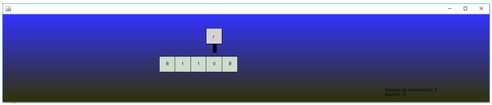
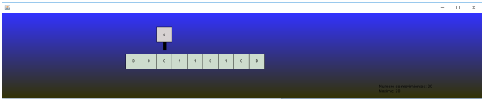
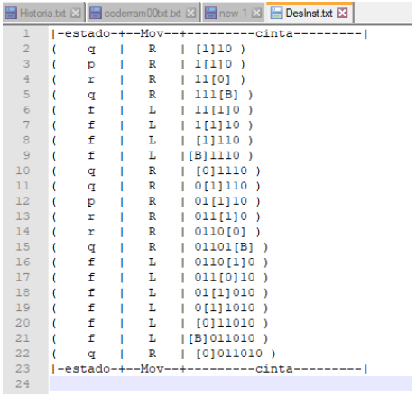

# TuringMachine
Animation of a Turing machine using Java
A Turing machine that simulates the rule 110 of cellular automata, the next table shows the states of the automata.

|   | 0 | 1 | B |
|---|---|---|---|
| q |(0,q,R)| (1,p,R) |(0,f,L)|
|p |(1,q,R) |(1,r,R)| X|
|r |(1,q,R) |(0,r,R)| X|
|f |(0,f,L) |(1,B,L)| (0,q,R)|

